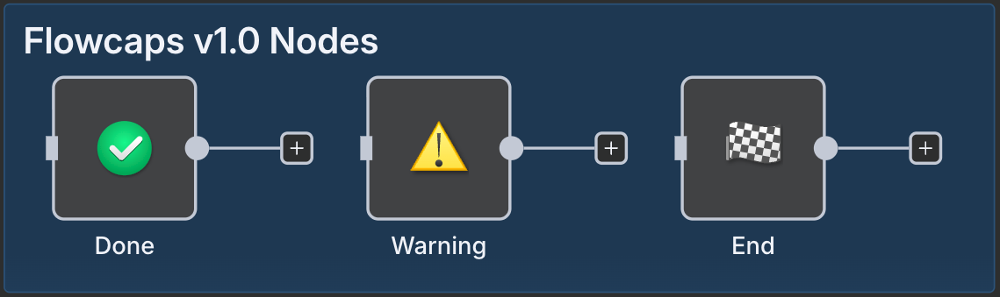

# n8n Community Node: FlowCaps

This is an n8n community node package that provides simple visual marker nodes, called **FlowCaps**, to help organize and clarify your n8n workflows.

These nodes are functionally identical to the built-in `NoOp` (No Operation) node – they simply pass input data through unchanged. Their primary purpose is to serve as visual cues or end-caps within a workflow diagram.

## Nodes Included

- **✔ Done (`flowCapDone`)**

  - **Icon:** 
  - **Color:** `#00cc66`
  - **Description:** Marks the successful completion or a specific success path within a workflow branch.

- **🏁 End (`flowCapEnd`)**

  - **Icon:** 
  - **Color:** `#555555`
  - **Description:** Clearly indicates the final end-point or terminal state of a workflow or major section.

- **⚠ Warning (`flowCapWarning`)**
  - **Icon:** 
  - **Color:** `#ffcc00`
  - **Description:** Flags potentially problematic, risky, incomplete, or temporary sections of a workflow that require attention.

## Installation

Follow the [installation guide](https://docs.n8n.io/integrations/community-nodes/installation/) in the n8n community nodes documentation.

1. Go to **Settings > Community Nodes**.
2. Select **Install**.
3. Enter `n8n-nodes-flowcaps` in the search box.
4. Agree to the risks and install the package.

## Usage

After installation, you can find the FlowCap nodes in the node panel under the "Transform" category (or by searching for "Done", "End", or "Warning"). Drag them onto your canvas like any other node to visually mark specific points in your workflow.

They require no configuration and simply pass data through.

## Compatibility

Requires Node.js >=18.10 and n8n community node support.

## Development

Clone this repository, run `pnpm install`, and then `pnpm run build` or `pnpm run dev`.

### Troubleshooting

If icons don't appear:

1. Run `pnpm run build` to ensure icons are copied to `dist/nodes/`
2. Clear n8n cache: `rm -rf ~/.cache/n8n/`
3. Restart n8n and hard refresh browser (Ctrl+Shift+R)
4. Verify icon endpoints: `http://localhost:5678/icons/CUSTOM/path/to/icon.svg`

## License

MIT
